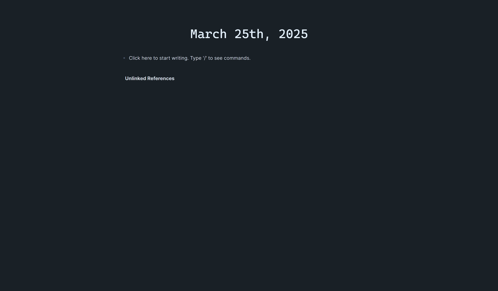
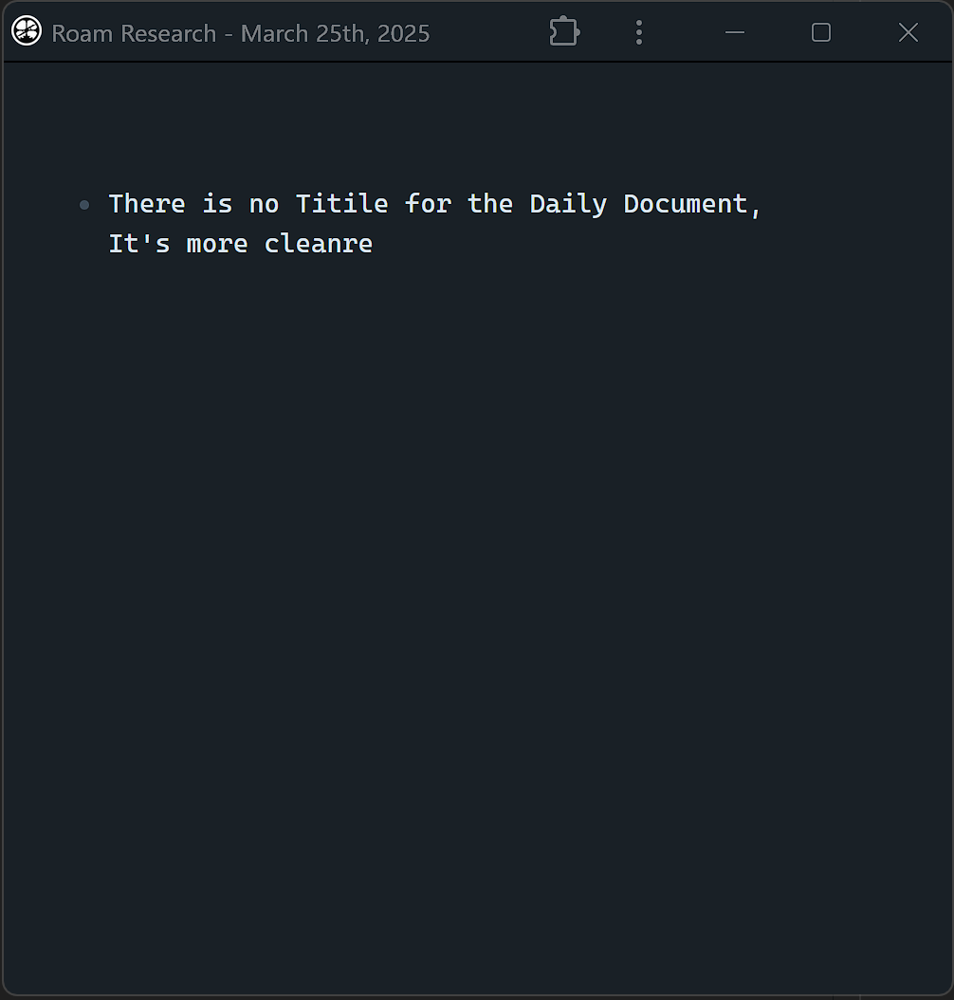

These are some css and js snippets for Roam Research.

## How to use?
- {{[[roam/css]]}}
    - ```css
      put the code into here
      ```

- {{[[roam/js]]}}
    - ```js
      put the code into here
      ```

## Introduce to snippets
### createFirstBlock (roam/js)
This js can keep your sight always at the top of the page, and that will reduce the distraction of page scrolling to your attention. 

1. the hotkey to create the first block is `ctrl+shift+enter` but You can customize the hotkey just you like
2. you also can decide the space sby adding more `onClick()` 
 



### noDailyTitle (roam/css)
The daily document essentially is an input space that is automatically generated every day and it's just named by the date. So if you want a more cleaner input space, you really should consider this one.
